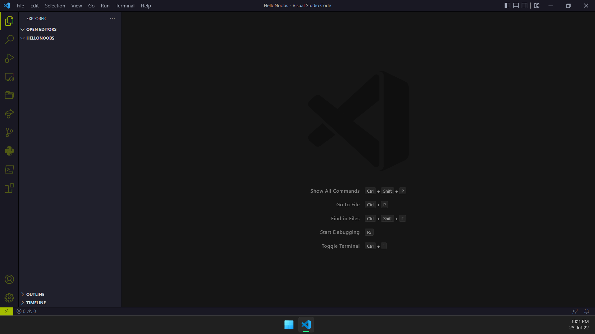
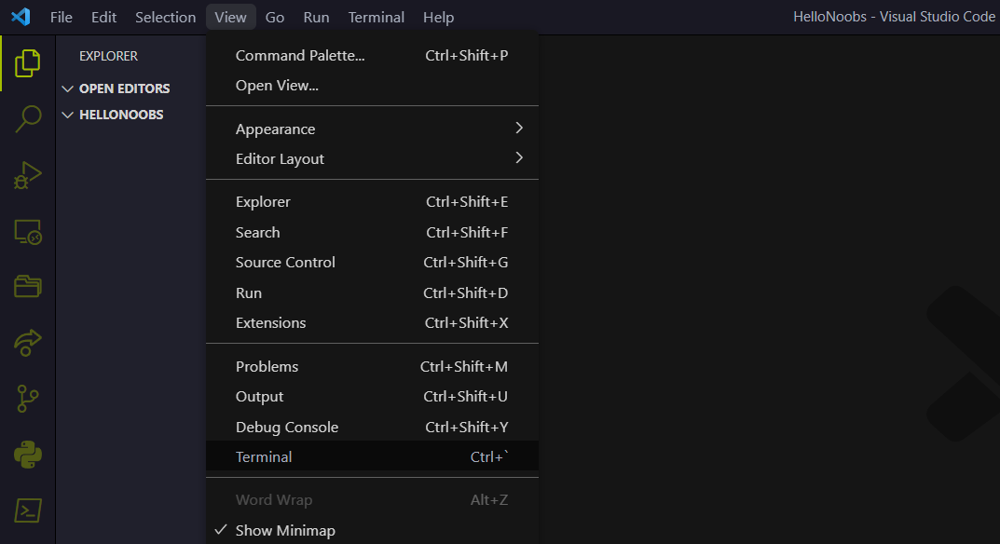
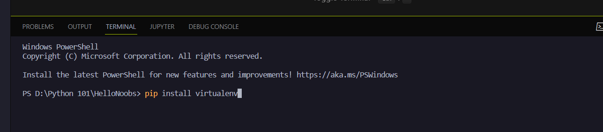
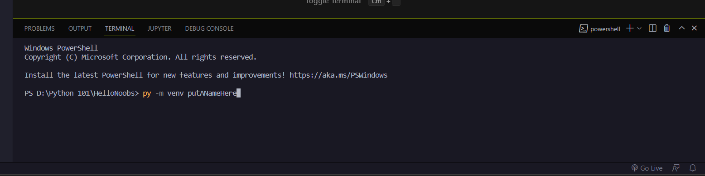
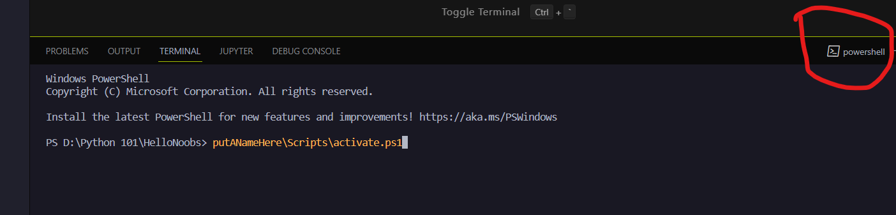
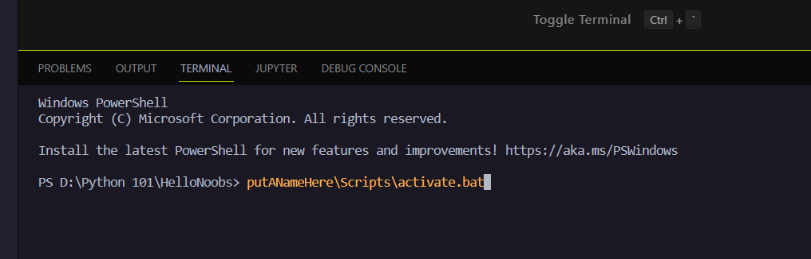
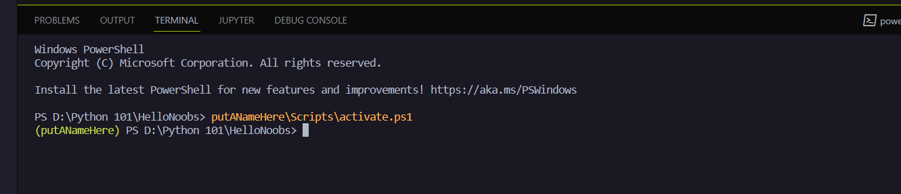

# Python-Virtual-Environment-Tutorial

## Overview

Virutal Environment is a room for you to play around your python project without effect your computer and other projects.

This file will teach you how to create python virtual environment and how to activate/deactivate it in vscode.

## Step by step

### Step 1: Open/Create Project

Open your 'project folder' if you already had a project, or create a new one if you didn't have any.



### Step 2: Open Terminal

Open the terminal



### Step 3: install Virtual Environment package

Type "pip install virtualenv" in the terminal then press enter

```
pip install virtualenv
```



### Step 4: Create Virtual Environment folder

By using the following command (run it in the terminal)

```
py -m venv putANameHere
```

you can replace any name you want to "putANameHere"

'-m' is short for 'module'

'venv' is the module name (short for 'virtual environment')



### Step 5: Activate the Virtual Environment

Now, we are ready to work with the virtual environment.

Let's activate it by using the following command (run it in the terminal)

**If you are usin the "powershell" command prompt, use this**

```
putANameHere\Scripts\activate.ps1  
```


or .\putANameHere\Scripts\activate.ps1  
or .\putANameHere\Scripts\activate
should be fine too

**If you are using the "cmd" command prompt, use this**

```
putANameHere\Scripts\activate.bat
```



## TADA!

Then you should see the folder name in the front of the command like this



if you get the (putANameHere) - or whatever your environment's folder name is - that mean you already working in your virtual environment!

Feel free to install packages and do whatever you want to do in this envirenment. It will not effect your computer and your other python projects!
